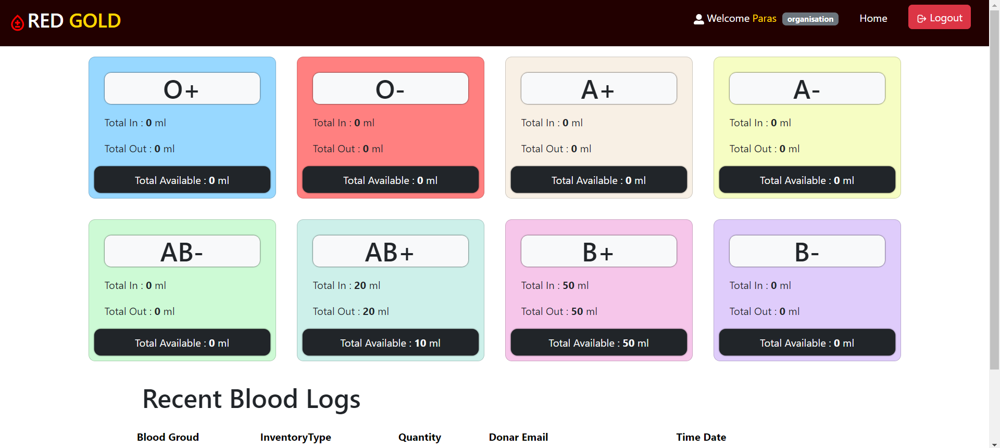

# BloodLink

**BloodLink** is a comprehensive web application built using the MERN (MongoDB, Express.js, React, Node.js) stack. It streamlines the management of blood donation activities by catering to different user roles such as admin, donor, hospital, and organization.

## Features

### User Roles:
- **Admin:** Oversees system settings, manages user roles, and monitors data.
- **Donor:** Registers as a blood donor, views personal information and donation history, and donates blood via organizations.
- **Hospital:** Maintains blood inventory, requests blood from organizations, and monitors consumers.
- **Organization:** Coordinates blood drives, organizes events, and tracks donation statistics.

### Authentication:
- Utilizes **JWT (JSON Web Tokens)** for secure authentication.
- **Bcrypt** is used for password encryption to ensure robust security.

### Frontend:
- Developed using **React.js** for a dynamic, responsive user experience.
- State management is powered by **Redux Toolkit**.
- **Bootstrap** is integrated for sleek, mobile-friendly styling.

### Backend:
- Built using **Node.js** and **Express.js**, adhering to the **MVC (Model-View-Controller)** architecture.
- **MongoDB** is used as the database, with **Mongoose** for structured data modeling.
- Supports **Axios** and **Cors** for smooth cross-origin requests and responses.
- **Morgan** and **colors** are used for detailed error logging.

## Getting Started

### Prerequisites

- Node.js and npm installed on your machine.
- MongoDB database.

### Installation

1. **Backend:**
   ```bash
   npm install
   ```
   Configure the MongoDB connection in config/db.js.
2. **FrontEnd:**
   ```bash
   cd client
   npm install
   ```
### Running the Application
In root directory
```bash
npm start
```
The React app will be accessible at http://localhost:3000.

### Note:
#### Set your .env
- Frontend:
  REACT_APP_BASEURL = http://localhost:8080/api/v1
- Backend:
  JWT_SECRET, MONGO_URL, DEV_MODE = development, PORT = 8080

### Deployment
- Backend: Deployed on Render.
- Frontend: Deployed on Netlify.

## Screenshots



